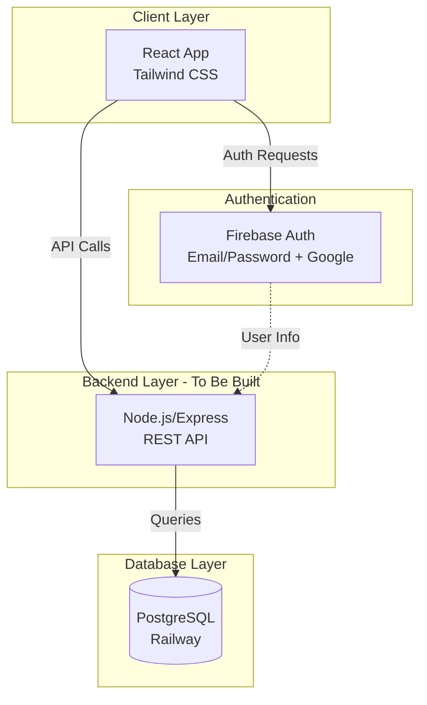
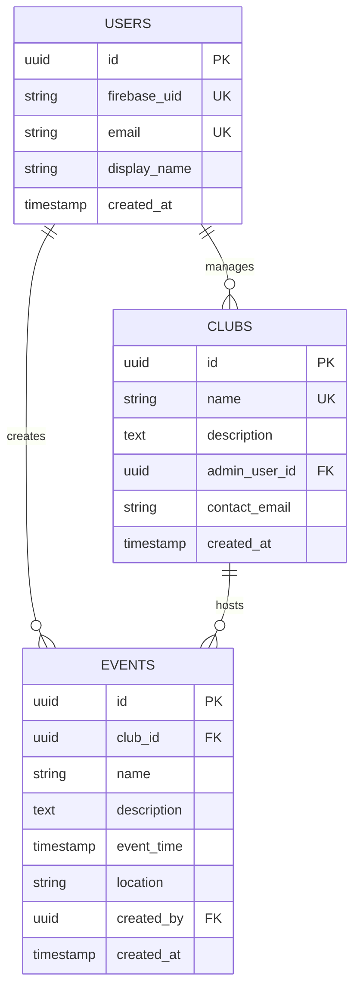

# Hunter Events Portal

A web application for Hunter College students to discover and manage campus events. Built with React, Firebase Authentication, and designed to integrate with a PostgreSQL database.

## Features

- **User Authentication**
  - Email/Password sign up and login
  - Google Sign-In integration
  - Firebase Authentication

- **Event Management**
  - Browse daily campus events
  - Create and manage events (Club Admins)
  - Event details: name, time, location, description, hosting club

## Tech Stack

### Frontend
- **React** 19.2.0
- **React Router** 7.9.4
- **Tailwind CSS** 3.4.1
- **shadcn/ui**

### Authentication
- **Firebase Authentication**
- **Google OAuth**

### Database (Proposed)
- **PostgreSQL**
- Backend API to be implemented
- **Railway**

## System Architecture

### High-Level Architecture


### Database Schema (ERD)



## Setup Instructions

### Prerequisites
- Node.js (v14 or higher)
- npm or yarn
- Firebase project with Authentication enabled
- Google Cloud Console OAuth configured

### Installation

1. **Clone the repository**
   ```bash
   git clone https://github.com/fuadfarhan05/huntereventsportal.git
   cd huntereventsportal/hunterevents
   ```

2. **Install dependencies**
   ```bash
   npm install
   ```

3. **Configure Firebase**

   Update `src/firebase/config.js` with your Firebase project credentials:
   ```javascript
   const firebaseConfig = {
     apiKey: "YOUR_API_KEY",
     authDomain: "YOUR_PROJECT.firebaseapp.com",
     projectId: "YOUR_PROJECT_ID",
     storageBucket: "YOUR_PROJECT.firebasestorage.app",
     messagingSenderId: "YOUR_SENDER_ID",
     appId: "YOUR_APP_ID",
     measurementId: "YOUR_MEASUREMENT_ID"
   };
   ```

4. **Enable Authentication Methods in Firebase Console**
   - Go to Firebase Console → Authentication → Sign-in method
   - Enable Email/Password
   - Enable Google Sign-In

5. **Run the development server**
   ```bash
   npm start
   ```

   The app will open at [http://localhost:3000](http://localhost:3000)

## Available Scripts

- `npm start` - Run development server
- `npm build` - Build for production
- `npm test` - Run tests
- `npm eject` - Eject from Create React App (one-way operation)

## Team

- **Development Team**: [miasdk](https://github.com/miasdk)
- **Tech Lead**: [fuadfarhan05](https://github.com/fuadfarhan05)

## License

This project is licensed under the MIT License - see the [LICENSE](LICENSE) file for details.

## Acknowledgments

- Hunter College for branding guidelines
- Firebase for authentication services
- Create React App for project scaffolding
